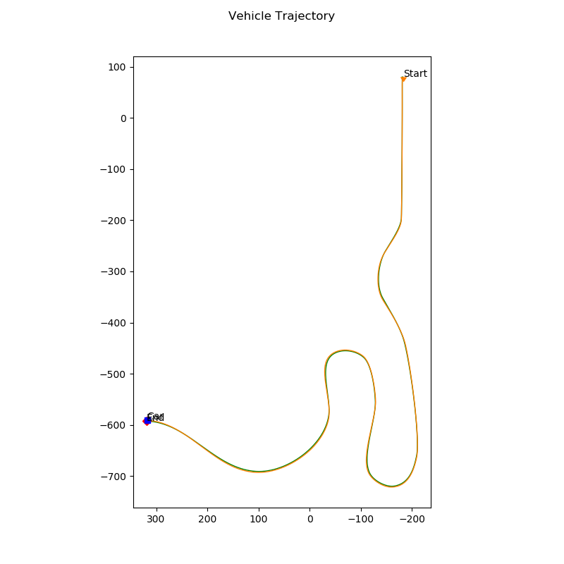
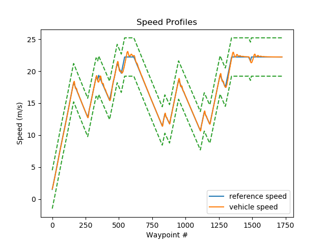
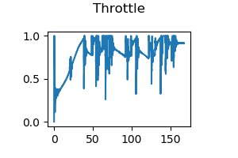
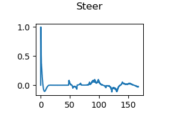
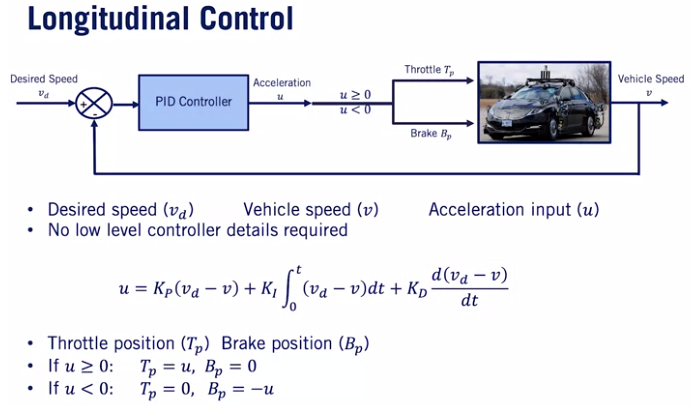
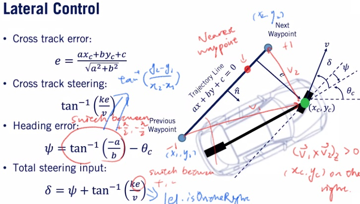

# Course1FinalProject
Introduction to Self-driving Cars (Course 1) Final Project 

_**Longitudinal controller (PID)**_ and _**lateral controller (Stanley Model)**_ for a car to follow given waypoints and velocity profile in **CARLA** simulator (_Python_)  
Illustration:  

## Results
Speed Profile:  
  

Throttle Input:  
  

Steering Input:  

## Longitudinal Controller (PID)
Illustration:  

## lateral Controller (Stanley Model)
Illustration:  

